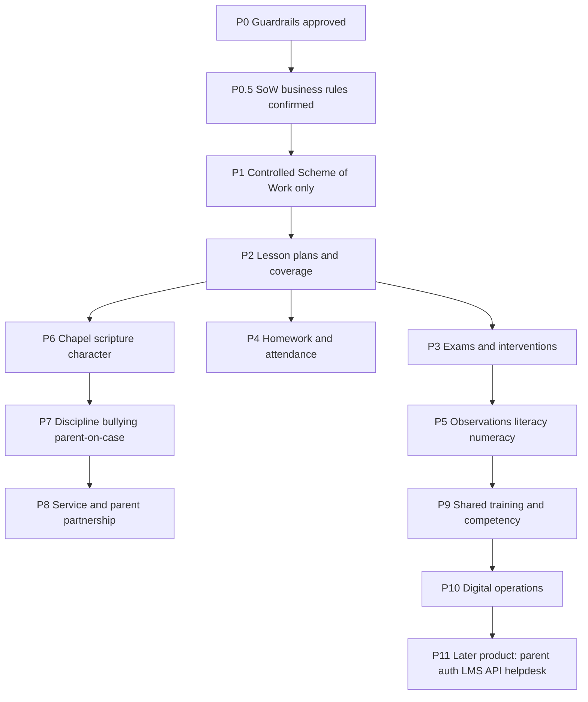

# WISCA PEMS — Implementation Roadmap

**Status:** Sequence and architecture only. No application code, migrations, routes, or UI have been changed.

**Inputs:**

- [WISCA-Functional-Gap-Analysis.md](WISCA-Functional-Gap-Analysis.md) (do not rewrite)
- Harmonised Framework `chambers/WISCA_v2.xlsx` (authoritative process reference)

**Purpose:** Group the 72 sub-activity gaps into **phased builds** that share master data, tables, workflows, evidence, KPI services, roles, and UI — so work is not one large change and foundations land before dependents.

**Rule:** Do not start coding until this roadmap is approved (and any open assumptions below are accepted or replaced).

**Refinements (24 Sep 2026):** measure layers (A1), evidence as a concept (A3), same-row vs child records (A4), aggregate vs learner-level (A5), **P0.5** SoW rules (BR-1–BR-12 approved), configurable-policy principle (A11), hard **P1-only** coding boundary. Spec: [WISCA-P1-Scheme-of-Work-Spec.md](WISCA-P1-Scheme-of-Work-Spec.md). Do not begin P2+ in the same change-set.

---

## 1. How this roadmap was derived

Gaps were grouped by **what they share**, not by pillar menu order.

| Shared capability | Gaps that depend on it |
|-------------------|------------------------|
| Controlled Scheme of Work + topics | AE-01.1, AE-03.1 alignment, AE-05 topic bind, AE-01.4 uncovered list |
| Lesson-plan submit / approve / file | AE-01.1 evidence, AE-05.1–.3, coverage gate |
| Coverage log + topic status | AE-01.2, AE-01.3, AE-01.4 gap list |
| `exam_results` + `assessment_key` | AE-02.1, AE-02.4, AE-07.3, AE-01.5 (optional) |
| At-risk + IIP | AE-02.2, AE-07.1–.3 |
| Class aggregate registers | AE-03, AE-04 (same “counts on a log” pattern) |
| Observation rubric | AE-06, DI-04.3 |
| Reading two-point capture | AE-08, AE-09 clone |
| Chapel session + roll | CE-01.1–.3 (type/quota, not a new product) |
| Scripture passages | CE-06.1–.3 |
| Incident / case row + statuses | CE-04, CE-05, DI-03.3, CE-07.3 |
| Guardians + signatures | CE-07.1, DI-06 |
| Staff/parent audience lists | DI-01.1, DI-03.1, DI-04.1, DI-06.2 (one training design) |
| STEM types + completions | DI-02.3 (inventory/timetable are separate new structures) |

Foundational work is whatever **other processes cannot run without**: approved SoW, reusable file evidence, reusable SLA timestamps, and (for exams) more than one `assessment_key`.

---

## 2. Working assumptions (approve or change before Phase 1)

These are proposed so the sequence is implementable. They are not coded.

| ID | Assumption | If you reject it |
|----|------------|------------------|
| A1 | Board scorecard stays the **21 executive KPIs**. The 72 sub-activities must **not** automatically become 72 executive KPIs. Distinguish **executive KPIs** (dashboard / Board), **operational KPIs/measures** (activity-level capture), **process-compliance measures** (was the step done on time / by the role?), and **evidence/verification indicators** (is there a record, approval, file, or linked artefact?). Do **not** change existing executive KPI definitions unless explicitly approved. | Phase KPI work expands; capture still comes first. |
| A2 | **Reuse / extend existing tables** before new modules. New structures only where the gap analysis listed them (inventory, training, ledgers, e-portfolio, AE-09/10, in-app helpdesk). | More greenfield tables earlier. |
| A3 | No document-management system. **Evidence is a reusable concept**, not a synonym for `file_path`. It may be a file, a system record, an approval, a verification action, an assessment result, an attendance row, an observation, a timestamp, a signed record, or a linked record. Reuse Storage/`file_path` only where a file is the right artefact. | Add a vault phase. |
| A4 | Default: **same-row** states for linear, single-instance processes. If a stage can **repeat** or needs its own participants, evidence, timestamps, decisions, notes, or multiple follow-ups, use a **child record** for that stage. Do **not** build a generic case engine unless analysis shows one is required. | Broader child-record work, still not a generic engine. |
| A5 | **Aggregates first** where the framework only needs an aggregate measure. Where it requires **identifying, following up, or measuring named learners**, the data model must support learner-level identification and follow-up. Do **not** introduce a full learner ledger unless the framework requires it. | Larger ledger work in P4 / P8. |
| A6 | **One shared training-and-attendance** capability for LMS, ethics, ICT, and parent orientation. | Four separate logs. |
| A7 | **Parent login / parent portal product** is out of the first delivery. DI-06 stays a staff registry + manual activity until a later product phase. | A large auth/UI phase jumps the queue. |
| A8 | **AE-10 Assimilation** waits until a measurement instrument is defined. **AE-09 Numeracy** may clone AE-08 after literacy is stable. | Design both schemas before any progress table. |
| A9 | Dual-target rows (AE-02.4, CE-01.3, CE-04.3, CE-06.3, DI-03.2, DI-04.1, …): implement **data capture**; do **not** invent a combined formula. Extra numbers stay reports until the Board picks one. | Pause those KPI services. |
| A10 | Confirmed: AE-04.2 owner is **Teacher**; AE-01.5 target is **95%**. | Already in the gap report. |
| A11 | Where the Framework states a policy, threshold, frequency, deadline, target, day, quota, or SLA that management may change, **do not hard-code** it. Identify the policy, choose the smallest honest scope, store it as controlled configuration, restrict who can change it, audit changes, use effective dates/session/term when history matters, and have code **consume** the setting. Keep the Framework’s current value as the **initial default**. Do **not** create a config row for every sentence in the spreadsheet. | Deadlines and SLAs stay in source until a later retrofit. |

---

## 3. Recommended sequence (overview)

Phases 2–4 can overlap **after** P1 is in place. P6 does not need P3. P9 should not start four separate training screens. P11 is optional and must not block P1–P10.

Do **not** implement P1–P11 as one change-set.

---

## 4. Foundational capabilities (build once, reuse)

Implement these as **shared primitives**, not once per activity.

| Capability | Why first | Reuse | Typical consumers |
|------------|-----------|-------|-------------------|
| **Scheme of Work control** | Teachers cannot plan against an approved baseline | `schemes_of_work`, `topics` | P1, P2, P4 (alignment) |
| **Evidence (concept)** | Many rows need verification, not always a file | Approvals, timestamps, records, optional Storage | P1 SoW file *if* required; later phases vary |
| **Decision + SLA timestamps** | Many framework clocks (24h, 48h, 5d, 10d) | `submitted_at`, `verified_at` already on some rows | P2, P7, P10 |
| **Assessment key** | Baseline ≠ term exam | `exam_results.assessment_key` | P3, optional P2 (AE-01.5) |
| **Shared training event + attendance** | Four DI/CE rows describe the same thing | Users, learners, `parents` as audience | P9, P10 |
| **Same-row case stages** | Avoid a new case engine | discipline / bullying / ethics rows | P7, P10 |

---

## 5. Phases

### P0 — Approval of this roadmap

Not a software phase. Confirm A1–A10 (or replacements).

### P0.5 — Scheme of Work business-rule confirmation

**Resolved (24 Sep 2026).** BR-1–BR-12 and **RD-1–RD-8** are recorded in [WISCA-P1-Scheme-of-Work-Spec.md](WISCA-P1-Scheme-of-Work-Spec.md). Do not code P1 until you give an explicit instruction to implement P1 only.

---

### P1 — Controlled Scheme of Work (this phase only)

**Intent:** Controlled Scheme of Work → approval → active baseline → evidence → teacher access to the approved baseline.

**Out of this change-set:** P2 lesson-plan/coverage workflow changes, Thursday enforcement, catch-up/SIP, checklist, SLA reports, P3+.

| Item | Detail |
|------|--------|
| **Framework** | AE-01.1 depends on a controlled, approved SoW. Teachers **plan against Active**. |
| **Sub-activities** | **AE-01.1** prerequisite only. |
| **Reuse** | `schemes_of_work`, `topics`. Dual HoS+Board approval on the same row. Optional supplementary file. |
| **New** | Versioned rows; one Active per session/term/class/subject; HOD draft/submit; reject-to-draft with audit; teacher read-only. |
| **Database** | Extend SoW (version, two approval slots, submit/reject audit, unique Active). No lesson-plan/coverage schema change. |
| **KPI** | Executive AE-01 **unchanged** (still `approved` + `active`). Operational SoW checks are on-screen only. |
| **Dependencies** | P0.5 and RD-1–RD-8 done. Blocks P2. |
| **Risks** | Two Actives; cascade-delete of old topics; Board approve before HoS. |

---

### P2 — Lesson plans and curriculum coverage

**Intent:** Complete the strongest existing academic workflow and connect it to SoW + coverage.

| Item | Detail |
|------|--------|
| **Framework** | Planning/submission **deadline is a configurable policy** (A11). Harmonised Framework **Thursday** is the **initial default**, not a hard-coded weekday. Deliver + HOD check (AE-01.2–.3); lesson-plan submit / review / approve (AE-05). Catch-up SIP (AE-01.4) can start as “create catch-up from uncovered topics.” |
| **Sub-activities** | AE-01.1 (bind), AE-01.2, AE-01.3, AE-01.4 (minimal), AE-05.1, AE-05.2, AE-05.3. |
| **Reuse** | `LessonPlanController` statuses, `on_time` / `due_at`, file upload, HOD approve/reject; `topic_coverage_logs` submit/verify/reject; coverage KPI; AE-05 calculation service. |
| **New** | Configurable due-day policy (scope TBD: school / session / term / process); code **consumes** the setting (no Thursday/Monday branches). Optional review checklist; SLA report; HOD catch-up from uncovered topics. |
| **Database** | Extend `lesson_plans` (checklist JSON) and/or `topics` / a thin catch-up link. Avoid a new SIP module in this phase. |
| **Workflow** | Keep submit → approve → coverage → verify. Add HOD “open catch-up” from uncovered topics. |
| **Permissions** | Existing teacher / HOD / HoS. No new roles. |
| **UI** | Existing lesson-plan and coverage screens plus a controlled policy setting. AE-01 tabs stay shared registers. |
| **Dependencies** | **P1.** |
| **Testing** | Coverage still requires approved plan; SLA uses existing timestamps; catch-up does not break AE-07 IIPs if tables are shared. |
| **Risks** | Overloading `intervention_plans` for curriculum gaps (gap report option B). Prefer a topic-linked catch-up if IIP meaning must stay learner-risk. Dual KPI: keep executive AE-01 as topic-cover % (A1). |

---

### P3 — Examinations and academic intervention spine

**Intent:** Baseline → identify → IIP → later comparison, using marksheets and at-risk that already exist.

| Item | Detail |
|------|--------|
| **Framework** | AE-02.1–.4, AE-07.2–.3 (enrolment already partly AE-07.2). |
| **Sub-activities** | AE-02.1, AE-02.2, AE-02.3 (only if tagged remedial sessions — else defer timetable), AE-02.4, AE-07.3. |
| **Reuse** | Exam marksheet, `ExamCalculationService`, `at-risk.from-exam`, `at_risk_learners`, `intervention_plans`. |
| **New** | `assessment_key` values such as `baseline` (and later post-check); AE-02 tab opens the below-pass queue + IIP; optional remedial tag on a session/log. Do not invent AE-02.4’s combined pass/growth formula (A9). |
| **Database** | **Extend** `exam_results` usage (key already exists, currently fixed). Maybe term-week window config. No new exam table required. |
| **Workflow** | Week 1 baseline marksheet → gap list → IIP; term exam remains executive AE-02. |
| **Permissions** | Existing `canEnterExamResults` / `canIdentifyAtRisk` / `canManageInterventionPlans`. Confirm teachers may enrol on IIPs (sheet says Teachers for AE-02.2). |
| **UI** | Same marksheet with assessment switch; deeper link from exam-results to at-risk. |
| **Dependencies** | P1 not strictly required. Better after P2 so staff are used to staged academic work. AE-01.5 can reuse baseline/spot keys later. |
| **Testing** | Term-exam KPI must not mix baseline rows; from-exam queue uses the chosen key; IIP KPI unchanged unless you redefine it. |
| **Risks** | Changing `assessment_key` without filtering breaks school-wide pass rate. Dual target AE-02.4. |

---

### P4 — Homework and attendance registers

**Intent:** Same pattern: extend class logs; Teacher owns AE-04.2.

| Item | Detail |
|------|--------|
| **Framework** | AE-03.1–.3, AE-04.1–.3 (punctuality, ≥95% list, follow-up to management). |
| **Sub-activities** | AE-03.1–.3, AE-04.1–.3. |
| **Reuse** | `homework_logs`, `attendance_logs`, weekly calculation services, teacher assignment scope. |
| **New (A5 default)** | Homework: planned/given or weekly quota; make-up / follow-up fields. Attendance: `late_count` or equivalent; teacher weekly exception view; follow-up tick + optional note to management. **Not** a full per-learner ledger in this phase unless A5 is reversed. |
| **Database** | **Extend** the two log tables. New child tables only if A5 is reversed. |
| **Workflow** | Still teacher CRUD. Add follow-up completion, not HOD approval (sheet does not require it). |
| **Permissions** | Teacher (including AE-04.2). Existing officer may still record headcount; monitoring list is Teacher. |
| **UI** | Existing forms + a “this week’s exceptions” panel on attendance. |
| **Dependencies** | P1 helps AE-03.1 “aligned with curriculum” but is not a hard block if quota is used instead of SoW-planned items. |
| **Testing** | Executive AE-03/AE-04 still compute from counts; empty new fields do not null old rates. |
| **Risks** | Building per-learner attendance here explodes scope. Management “report” without notifications stays an on-screen list unless you add mail later. |

---

### P5 — Observations, literacy, numeracy

**Intent:** Close the supervision cycle; clone progress capture; leave assimilation undefined.

| Item | Detail |
|------|--------|
| **Framework** | AE-06.1–.3, AE-08.1–.3, AE-09.1–.3. AE-10 out of scope (A8). |
| **Sub-activities** | AE-06.*, AE-08.*, AE-09.*. |
| **Reuse** | `Observation` + `ObservationRubric`, `ObservationCalculationService`; `reading_assessments` + `ReadingCalculationService`. |
| **New** | Planned-observation quota or schedule; teacher acknowledgement; `follows_observation_id`; optional monthly literacy checkpoints; **numeracy tables modelled on reading**. |
| **Database** | Extend `observations`. Extend or clone reading table for numeracy + KPI seed AE-09. |
| **Workflow** | scheduled → completed → follow-up observation. Literacy stays two-point unless monthly fields are approved. |
| **Permissions** | Existing observers; literacy coordinator / teacher / HOD as today. Numeracy: Teacher (baseline) / HOD (monthly and termly) per workbook. |
| **UI** | Observation show + follow-up action. Coming-soon numeracy becomes a real register (clone reading UI). |
| **Dependencies** | Soft: P3 if AE-08 struggling readers should open AE-07. DI-04.3 later reuses the digital rubric add-on. |
| **Testing** | Executive AE-06 remains same-visit effective rate unless you add a second series; AE-08 growth_min unchanged; AE-09 isolated KPI. |
| **Risks** | “≥1 year growth” vs level points still needs Board language (gap report). AE-10 must not be faked with homework %. |

---

### P6 — Chapel, scripture, character delivery

**Intent:** Distinguish session types and teach-logs without new worship products.

| Item | Detail |
|------|--------|
| **Framework** | CE-01.1–.3, CE-06.1–.3, CE-02.1 and CE-02.3 (delivery / recognition). CE-02.2 stays termly Secure+ under A1. |
| **Sub-activities** | CE-01.*, CE-06.*, CE-02.1, CE-02.3. |
| **Reuse** | Chapel types/sessions/roll; `school_wide`; participation levels; scripture passages + booleans; character domains/ratings. |
| **New** | Enforce/filter assembly vs class vs chapel types + weekly quotas; optional session file; scripture “taught this week/class”; optional recitation score; character activity log or lesson-plan tag; recognition flag. |
| **Database** | Mostly **config + extend** (taught flag, score, `recognized`). Character activities: tag `lesson_plans` **or** a small log (gap options). |
| **Workflow** | No new approval chain unless you add session approval (not required to start). |
| **Permissions** | Chaplain, Class Teacher, AHS/HoS as workbook. Existing chapel/character/scripture gates. |
| **UI** | Filters on chapel index; small taught UI on scripture; character extras on existing marksheet or lesson plans. |
| **Dependencies** | Independent of P3–P5. Evidence helper from P1 if photos are in scope. |
| **Testing** | Executive CE-01 must stay stable or be explicitly switched to type-filtered rates (A1). |
| **Risks** | Dual chapel target (attendance vs active). Changing CE-01 formula mid-year without Board sign-off. |

---

### P7 — Restorative discipline, bullying, parent-on-case

**Intent:** Same-row stages and clocks (A4). Link parent collaboration to existing cases (CE-07.3).

| Item | Detail |
|------|--------|
| **Framework** | CE-04.*, CE-05.*, CE-07.3. DI-03.3 may follow the same SLA pattern in P10. |
| **Sub-activities** | CE-04.1–.3, CE-05.1–.3, CE-07.3. |
| **Reuse** | `discipline_incidents`, `bullying_cases`, type catalogues, existing status enums, guardians. |
| **New** | Required fields when type says restorative; `acknowledged_at`; investigation notes on the row; `followed_up_at`; recurrence = query later incidents same learner; parent-contact fields on the case. |
| **Database** | **Extend** two case tables (+ optional parent_id / contacted_at). No case-engine schema. |
| **Workflow** | Soft locks: cannot close without plan/ack as you define; follow-up after close. |
| **Permissions** | Teacher logs; AHS/HoS ack/conversation; Chaplain plans (CE-04.3); HOD bullying follow-up. Align controller gates with workbook (today they are wider). |
| **UI** | Existing forms, staged sections (not new routes unless useful). |
| **Dependencies** | Guardians exist (admin). P8 parent events are separate. |
| **Testing** | Executive CE-04/CE-05 numerators must not break; SLA reports are extra (A1/A9). |
| **Risks** | Tightening roles will hide screens some demo users use today. Recurrence definition must be written (N days). |

---

### P8 — Community service and parent partnership events

**Intent:** Calendar + hours; keep CE-07.1 signatures; add spiritual events only if approved.

| Item | Detail |
|------|--------|
| **Framework** | CE-03.*, CE-07.1 (small), CE-07.2. |
| **Sub-activities** | CE-03.1–.3, CE-07.1 (handbook issued), CE-07.2. |
| **Reuse** | Service types + verify/reject logs; partnership charters + signatures; `parents`. |
| **New** | Scheduled/approved projects (extend types or thin project rows); per-learner hours **if** you lift A5 for service only; recognition flag; handbook-issued on signature; parent event roll (new attendance rows for parents — listed as new structure in the gap report). |
| **Database** | Project dates on types **or** new project table. Per-learner hours = **new relationship**. Parent chapel-like roll = **new or extended attendance**. |
| **Workflow** | Keep service verify. Add project approve if CE-03.1 is in this phase. |
| **Permissions** | Chaplain plans; HODS log/recognize; Chaplain CE-07. |
| **UI** | Service form + optional participant grid; partnership form extras; parent event screen (new). |
| **Dependencies** | P7 if CE-07.3 already added parent contact on cases. Reconcile seed CE-03 target **10 hours** vs workbook **≥2 hours/learner**. |
| **Testing** | Verified-hours KPI vs new per-learner KPI must not be mixed silently. |
| **Risks** | Per-learner service + parent events are the heaviest CE build. Can split: 8a calendar/recognition flags, 8b ledgers/events. |

---

### P9 — Shared training and staff digital competency

**Intent:** One training primitive; then competency extras. Do not build four workshop modules.

| Item | Detail |
|------|--------|
| **Framework** | DI-01.1, DI-03.1, DI-04.1, DI-06.2 (orientation). DI-04.2–.3. |
| **Sub-activities** | Those five, plus DI-04.2, DI-04.3. |
| **Reuse** | Users, learners, parents; `digital_competency_areas` / ratings; `Observation` (DI-04.3). |
| **New** | Training event (audience type, date, materials) + attendance; `coach_id` or pairing on competency; digital standards on observation rubric; HOD access to observe digital use (permission align with workbook). |
| **Database** | **New** training + attendance tables (shared). Competency/observation = **extend**. |
| **Workflow** | Schedule training → take register. Coaching pair. Observation as AE-06 with extra standards. |
| **Permissions** | ICT Coordinator leads training/coaching; Teachers attend ethics (DI-03.1); Admin Manager may view parent orientation; HOD observes (DI-04.3) — **controller today is ICT-only**. |
| **UI** | One training area with type tags (LMS / ethics / ICT / parent). Competency marksheet + observation link. |
| **Dependencies** | P5 if digital observation should be a real AE-06 follow-up. Else rubric-only is enough. |
| **Testing** | Four framework rows write to one module; reports filter by type. |
| **Risks** | Building training four times if this phase is skipped. |

---

### P10 — Digital operations (registers you already have)

**Intent:** Upgrade existing DI registers; add only the new structures that cannot wait for P11.

| Item | Detail |
|------|--------|
| **Framework** | DI-01.2 (proxy), DI-01.3 (optional light ticket), DI-02.1–.3, DI-03.2–.3, DI-05.*, DI-06.1 (registry), DI-06.3. |
| **Sub-activities** | Remaining DI rows not done in P9. |
| **Reuse** | LMS weekly logs, STEM completions/types, ethics audits, subject digital flags, parent monthly engagements. |
| **New** | STEM term inventory checklist (new, small); STEM practical sessions (new or subject-coverage reuse); ethics sample quota + SLA timestamps; exhibition flag; e-portfolio **URL per learner** (small table or column); portfolio review tick; inactive-parent `followed_up_at`. Helpdesk: skip or a **minimal** ticket if you refuse P11. |
| **Database** | Inventory + optional STEM sessions = **new**. Everything else **extend**. |
| **Workflow** | Keep marksheets. Add HoS inventory sign-off; ethics resolve clock; admin-manager follow-up. |
| **Permissions** | Workbook: HoS inventory, ICT practicals, HOD projects, HOD audits, HoS enforcement, Admin Manager parents. |
| **UI** | New small inventory/session screens; extras on existing DI forms. |
| **Dependencies** | **P9** first (training). P7 SLA pattern for ethics. A7: no parent passwords here. |
| **Testing** | Executive DI-01–DI-06 stay on current numerators unless you explicitly switch. |
| **Risks** | LMS API and real parent portal will dwarf this phase if pulled forward. Inventory can become a mini-ERP — keep a term checklist. |

---

### P11 — Later product (do not start with these)

Only after P1–P10 and a separate product decision.

- Parent user accounts and parent-facing academic/attendance views (DI-06.1 as real login)
- Live LMS / portal API (DI-01.2)
- In-app or external helpdesk as a product (DI-01.3, DI-06.2–.3)
- Computing **all 72** sub-KPIs on the executive dashboard
- Full evidence DMS
- AE-10 assimilation instrument
- Child-record case engine (if A4 is reversed later)

---

## 6. Cross-phase dependency map

| This capability | Must exist before |
|-----------------|-------------------|
| Approved SoW (P1) | Meaningful AE-01.1, SoW-aligned homework (P2/P4), topic-based catch-up (P2) |
| Lesson-plan approve (exists; completed in P2) | Coverage logs (already gated) |
| Baseline `assessment_key` (P3) | AE-02.1, AE-02.4, optional AE-01.5, AE-07.3 from exams |
| At-risk IIP (exists; wired in P3) | AE-02.2 as a process, not a second register |
| Training module (P9) | DI-01.1, DI-03.1, DI-04.1, DI-06.2 |
| Per-learner attendance (only if A5 reversed) | AE-04.2 named list, AE-04.3 follow-up quality |
| E-portfolio URL (P10) | DI-05.3 reviews |
| Parent users (P11) | True DI-06.1 / portal engagement |

---

## 7. Suggested first delivery

After P0.5 answers: implement **P1 only**, then stop. Do not start P2 in the same change-set.

P2 (configurable planning deadline → coverage) is the next slice after P1 is accepted.

---

## 8. Testing approach (all phases)

- Keep existing executive KPI tests/services from regressing (`*CalculationService`, seed targets).
- Add feature tests per phase for the new happy path and the **role** in the workbook (Teacher on AE-04.2, etc.).
- Seeded demo data: after P1, mark current schemes approved or teachers see empty SoW.
- Do not add sqlite-only tests that the repo cannot run; follow existing `tests/Unit` / `tests/Feature` patterns.

---

## 9. Stop

This file is the **implementation sequence**, not a licence to code.

**Not done:** no application changes.

**Wait for explicit approval** of:

1. A separate instruction to **code P1 only** (spec + RD-1–RD-8 are complete)

Do not implement P2+ until P1 is done and separately approved.
