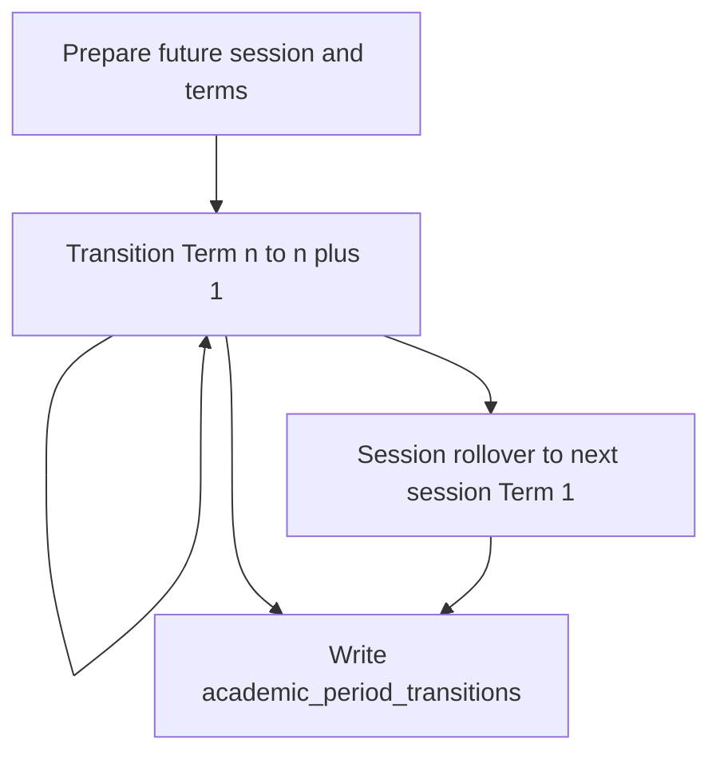

# P0+ — Academic Session & Term Lifecycle / Rollover

**Status:** Discovery complete. Architecture proposed. **Not implemented.**

**Date:** 24 September 2026

**Instruction:** Do not begin coding until you explicitly authorize **Implement P0+ only**.

**Related:** [WISCA-P1-Scheme-of-Work-Spec.md](WISCA-P1-Scheme-of-Work-Spec.md) (already implemented). P0+ must not break P1.

---

## Approved decisions (this review)

| Topic | Decision |
|-------|----------|
| Who may transition / roll over | **System Admin, Head of School, and Board.** No new Spatie role. Teachers excluded. |
| Write protection in P0+ | Lifecycle + one current-period resolver + **block new Scheme of Work create/submit on a closed session/term.** Do not rewrite every attendance / exam / coverage controller in this phase. |

---

# Phase 1 — Discovery findings

## 1. Existing Academic Session

**Already exists. Do not invent a second session architecture.**

| Item | Finding |
|------|---------|
| Table | `academic_sessions` |
| Model | `app/Models/AcademicSession.php` |
| Columns | `school_id`, `name`, `start_date`, `end_date`, `is_current` (boolean), `status` enum `upcoming \| active \| closed` |
| Admin UI | `resources/views/admin/sessions/` |
| Controller | `app/Http/Controllers/Admin/AcademicSessionController.php` |
| Access today | `/admin/sessions*` behind `admin` middleware — **System Admin only** |

`AcademicSession::markAsCurrent()` clears other sessions’ `is_current` flags and sets this row `is_current = true` and `status = active`. It does **not** close the previous session. There is **no unique index** guaranteeing one current session per school.

Admin “Set current” is a one-click flag flip, not a controlled rollover.

---

## 2. Existing Term

**Already exists. Do not invent a second term architecture.**

| Item | Finding |
|------|---------|
| Table | `terms` |
| Model | `app/Models/Term.php` |
| Columns | `academic_session_id`, `name`, `start_date`, `end_date`, `status` enum `upcoming \| active \| closed` |
| Missing | **No `is_current`.** **No sequence / display_order.** |
| Admin UI | `resources/views/admin/terms/` |
| Controller | `app/Http/Controllers/Admin/TermController.php` |
| Access today | System Admin only |

There is no “set current term” action. Terms can be created, edited, and deleted freely. Deleting a term is unconstrained.

---

## 3. Current-session mechanism

```
AcademicSession::currentForSchool($schoolId)
  → where school_id = ? and is_current = true
```

Used by the sidebar, topbar, dashboards, lesson plans, coverage, schemes, exams, attendance, and most KPI services.

**Gap:** application-level only. Two current sessions are possible if someone bypasses `markAsCurrent()`. Setting current does not close the outgoing session.

---

## 4. Current-term mechanism

```
Term::currentForSession($sessionId)
  → first status = active, newest start_date
  → else ANY latest term by start_date
```

**Gap:** the date fallback can treat a closed or upcoming term as current. There is no authoritative current-term marker.

---

## 5. Session / term foreign keys

### Historical — never reassigned on rollover

These rows already store `academic_session_id` and usually `term_id`. They stay on the period they were created under.

- `schemes_of_work` (P1: one Active per session + term + class + subject)
- `exam_results`
- `attendance_logs`
- `homework_logs`
- `observations`
- `reading_assessments`
- `at_risk_learners`
- `discipline_incidents`
- `bullying_cases`
- `service_logs`
- `scripture_assessments`
- `character_ratings`
- `chapel_sessions`
- `partnership_signatures`
- `digital_ethics_audits`
- `digital_competency_ratings`
- `stem_project_completions`
- `subject_digital_assessments`
- `lms_usage_logs`
- `parent_portal_engagements`
- `kpi_periodic_data`

### Indirect historical (period via parent)

- `topics` → `scheme_of_work_id`
- `lesson_plans` → `topic_id`
- `topic_coverage_logs` → `topic_id`
- `chapel_attendances` → `chapel_session_id`
- `intervention_plans` → `at_risk_learner_id`

### Carry-forward candidates — do **not** auto-migrate in P0+

| Record | How it works today |
|--------|--------------------|
| Learners | Current `school_class_id` only. Status `enrolled \| withdrawn`. No enrollment history, no promotion. |
| Classes | School-scoped. Not period-scoped. |
| Subjects | School-scoped. Not period-scoped. |
| Teacher assignments | `class_subject_teacher` is **per session** (unique class + subject + session). No term. |
| Staff / parents | Not period-scoped. |

### New-period records (created after the new period is current)

New Active Scheme of Work, new topics, new lesson plans, new coverage, new attendance, new assessments.

### Does not exist in this application

- Fees / payments
- Student promotion, graduation, transfer-out
- Generic audit / activity-log product (Spatie activity, etc.)

---

## 6. Existing rollover / promote / close-term

**None.**

| Looked for | Result |
|------------|--------|
| Promote / advance class | Not present |
| Close term | Not present |
| Session rollover | Not present |
| Set current session | Admin button only; does not close the old session |
| P1 SoW clone | New Draft for the **same** session + term. Not cross-period rollover |

Session delete is blocked only if `is_current`. Foreign keys `cascadeOnDelete` from session → terms (and session-scoped assignments). Deleting a historical session would be destructive. P0+ must add application-level delete guards.

---

## 7. Authorization today

| Action | Who |
|--------|-----|
| Create / edit sessions and terms | System Admin only |
| Set current session | System Admin only |
| HoS / Board | Strategy nav (dashboard, thresholds, schemes). **Cannot** open `/admin/sessions` or `/admin/terms` |
| Teacher | Cannot manage sessions/terms |

---

## 8. Existing audit infrastructure

**None suitable for period transitions.**

The word “audit” in the app means digital-ethics assignment checks, not a system change log. P0+ needs a small dedicated transition table.

---

## 9. P1 Scheme of Work points affected by academic period

| P1 rule | Implication for P0+ |
|---------|---------------------|
| SoW identity = session + term + class + subject | Rollover must not rewrite those FKs |
| One Active per that key | New period needs a **new** SoW row; old Active stays on the old period |
| Topics stay on their SoW | Do not move topics |
| Lesson plans stay on `topic_id` | Do not rewrite `topic_id` |
| Teacher plans against Active only | After rollover, teachers have no Active SoW until HOD/Board produce one for the new period |
| AE-01 counts `approved` + `active` | **Do not change the formula** |
| `Term::lessonPlanDueAt` is Monday of the instructional week | **Do not change** in P0+ |

Defaults for SoW index/create use `AcademicSession::currentForSchool()`. After P0+, that should resolve the new current session without rewriting SoW history.

---

## 10. Demo data today

`WiscaSeeder` creates:

- Session **2025/2026** — `is_current`, `active`
- Term **First Term** — `active`
- One Active JSS 1A Mathematics Scheme of Work

It does **not** yet show a previous closed session or Term 2 / Term 3.

---

# Phase 2 — Proposed architecture (not coded)

## Core principle

Academic rollover changes the school’s **operational period**. It does not rewrite academic history.

A record that belongs to `2025/2026 → Term 3` remains `2025/2026 → Term 3` after the school moves to `2026/2027 → Term 1`.

---

## Lifecycle model (reuse existing enums)

Do **not** add Planned / Open / Current / Closed as new status values. Map the specification onto what already exists:

| Spec idea | Existing field |
|-----------|----------------|
| Future / planned session or term | `status = upcoming` |
| Operational current session | `is_current = true` and `status = active` |
| Operational current term | **new** `terms.is_current = true` and `status = active` |
| Historical | `status = closed` |

### Schema additions (only what is missing)

On `terms`:

- `is_current` boolean, default false
- `sequence` unsigned integer (1, 2, 3…); default from start date if omitted

New table `academic_period_transitions`:

- `school_id`
- `action` (`term_transition` \| `session_rollover`)
- `performed_by`
- `performed_at`
- `previous_session_id`
- `previous_term_id`
- `new_session_id`
- `new_term_id`
- `notes` (nullable)

Partial unique indexes (same idea as P1 one-Active SoW):

- One current session per `school_id`
- One current term per `academic_session_id`

---

## One source of truth

Tighten `Term::currentForSession()` to **`is_current = true` only**. Remove the “latest by date” fallback.

Add `AcademicPeriodService` as the **only** place that **changes** the current period:

- `currentSession(schoolId)`
- `currentTerm(schoolId)`
- `acceptsNewActivity(session, term)` — both must be current/active, not closed
- `transitionToNextTerm(actor, notes)`
- `rolloverToSession(actor, targetSession, startingTerm, notes)`

Keep `AcademicSession::currentForSchool()` as the read helper used around the app. Retire unguarded Admin “Set current” so a period change cannot skip close + audit.



---

## Term transition

Same session: Term 1 → Term 2 → Term 3, in `sequence` order.

1. Confirm current term.
2. Confirm the next term exists and is `upcoming`.
3. Close current term (`closed`, `is_current` false).
4. Open next term (`active`, `is_current` true).
5. Session stays current.
6. Record actor, time, old period, new period, notes.
7. One database transaction with row locks.

**No skip** (Term 1 → Term 3) in P0+. No administrative override in this phase.

Do not copy lesson plans, coverage, attendance, assessments, payments, or SoWs into the next term.

---

## Session rollover

Example: `2025/2026 Term 3` → `2026/2027 Term 1`.

1. Confirm current session and that the current term is eligible to close (last term, or otherwise the configured starting point for rollover).
2. Target session must **already exist** with terms configured (create/configure is a separate step).
3. Confirm the starting term (normally `sequence = 1`).
4. Close current term and current session.
5. Activate target session and starting term.
6. Write the audit row.
7. One database transaction.

If the school is already on the target period, reject the request. Do not create a second current state.

Rollover does **not** invent the next session or its terms.

---

## Data carry-forward in P0+

| Class | P0+ behaviour |
|-------|----------------|
| A. Historical | Never migrated. FKs stay. |
| B. Carry-forward candidates | **Not implemented.** Learners stay in their current class. Teacher assignments are not copied. No fee work (no fee module). |
| C. New-period records | Created later by normal processes (HOD SoW, teacher plans, etc.). Rollover does not auto-create them. |

Student promotion is a **separate** future feature. Session rollover is not promotion.

---

## Authorization (proposed)

```
User::canManageAcademicPeriod()
  = isAdmin() || isHoS() || isBoard()
```

| Action | Who |
|--------|-----|
| Create / configure future session and terms | Admin, HoS, Board |
| Transition term | Admin, HoS, Board |
| Session rollover | Admin, HoS, Board |
| Delete session / term | **Admin only**, and only if not current and no dependent historical rows |
| Teacher | None of the above |

HoS and Board cannot use `/admin/*` today. Proposed: portal route such as `/academic-period` for the transition UI, plus keep Admin session/term CRUD. Add the page to the Strategy nav (same group as Schemes of Work).

---

## UI (minimum)

**Session management**

- View sessions and status
- Create a future session
- View terms in a session
- Configure term dates and sequence
- Identify the current session

**Academic period panel**

```
Current Session: 2025/2026
Current Term:    Term 3

Next Session:    2026/2027
Starting Term:   Term 1

[ Begin Session Rollover ]
```

Or, when a next term exists in the same session: **Transition to next term**.

**Confirmation**

```
You are moving the school from:

2025/2026 — Term 3

to:

2026/2027 — Term 1

Historical academic records will remain attached
to their original academic period.

Continue?
```

Language: Open Session, Close Session, Open Term, Close Term, Transition Term, Begin Session Rollover. Not “migrate records”.

---

## Safety rules

The service must prevent:

- Two current sessions
- Two current terms in the same session
- Opening a term from another session as the current term
- Skipping Term 1 → Term 3
- Closing a term and leaving no valid current period
- Activating a session that has no valid terms
- Teachers performing rollover
- Accidental double submit
- Partial success (transaction rollback)

Historical records must not have their session/term identity rewritten.

---

## P1 compatibility

After P0+:

- HOD can still create / clone / submit a Draft (clone stays same-period unless the HOD edits session/term on an unsubmitted draft).
- HoS then Board still approve; Board still activates.
- One Active per session + term + class + subject.
- Historical topics and plans stay on the old SoW.
- Teachers plan against Active SoW only.
- New SoW create/submit is rejected if the target session or term is closed.
- AE-01 formula unchanged.
- `Term::lessonPlanDueAt` unchanged.

After rollover, the new period has **no** Active SoW until the P1 workflow produces one. That is correct.

---

## Seed / demo (proposed)

Do **not** move the working demo SoW off 2025/2026 Term 1.

Add:

- Term 2 and Term 3 on 2025/2026 as `upcoming` (so term transition can be demonstrated)
- Optional closed prior session `2024/2025` with three closed terms (no SoW required) so the list shows history

The acceptance picture (2025/2026 all closed → 2026/2027 Term 1 current) is a **test fixture**, not a destructive reseed of the live demo.

---

## Tests (when coding is authorized)

- Create future session and configure terms
- Cannot have two current sessions
- Open / close session and term
- Term 1 → Term 2 → Term 3
- Cannot skip a term
- Cannot open another session’s term as current
- Rollover 2025/2026 Term 3 → 2026/2027 Term 1
- Old session/term remain historical
- Historical record FKs unchanged
- Transition audited
- Double submit rejected
- Forced failure: old state intact, no partial new current period
- Teacher 403 on transition
- P1 SoW workflow, topic preservation, teacher Active-only planning
- AE-01 still `approved` + `active`
- `lessonPlanDueAt` still Monday

---

## Explicit P0+ exclusions

- Student promotion, admission, graduation, transfer-out
- Teacher-assignment auto-copy
- Fee restructuring / payment migration
- Lesson-plan deadline configuration
- Thursday / Monday logic
- Coverage verification, SIP / catch-up
- New executive KPIs
- Document management
- New Spatie roles
- Rewriting historical records
- Mass write-lock of every module
- P2 / P3+ features

---

## Assumptions (stated, not coded)

1. Term order is `sequence`, defaulted from `start_date` if the form omits it.
2. No skip-term override in P0+.
3. Preparing a future session is a separate create/configure step. Rollover does not invent terms.
4. Category B carry-forward (learners, assignments, fee structures) waits until those business rules are set separately.

---

## Stop

Phase 1 (discovery) and Phase 2 (architecture) are complete.

**Do not implement** until you give an explicit instruction to **Implement P0+ only**.
