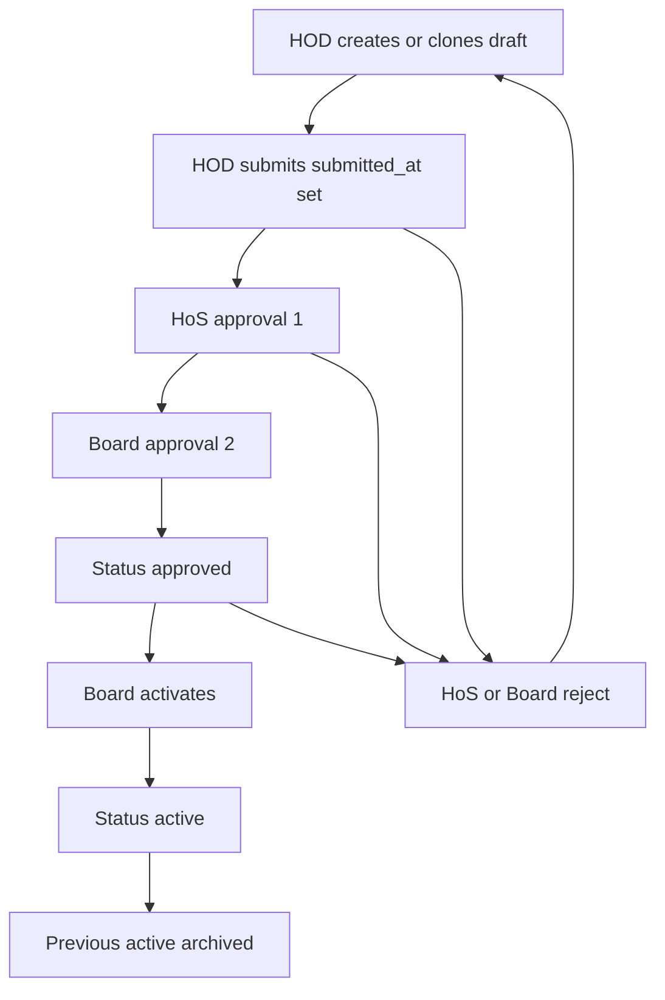

# P1 — Scheme of Work final specification

**Status:** Specification only. BR-1–BR-12 and **RD-1–RD-8 are approved** (24 Sep 2026). No application code, migrations, routes, or UI have been changed.

**P1 change-set (when coding is separately approved):**  
Controlled Scheme of Work → dual approval (HoS + Board) → Active baseline → evidence → teacher read-only access.

**Do not code until explicitly instructed.**

---

## 0. Approved decisions (P0.5)

| ID | Approved rule |
|----|----------------|
| BR-1 | **HOD** creates / uploads the SoW. |
| BR-2 | **Board and HoS** review a submitted SoW. |
| BR-3 | **Board and HoS** approve. There are **approval 1** and **approval 2**. Status becomes `approved` only when **both** have approved. |
| BR-4 | Reject → **Draft**; **reason mandatory**; HOD revises and resubmits. No persistent `rejected` status unless needed for audit. The **rejection action** must remain auditable. |
| BR-5 | Replacement = **new row / new version**. Never overwrite in place. When the new row becomes **Active**, the previous live version becomes **Archived**. |
| BR-6 | **One Active** SoW per session + term + class + subject. Many historical (archived) versions allowed. |
| BR-7 | `draft` = HOD preparing; `approved` = both approvers signed, **not** yet the operational baseline; `active` = teachers plan against this; `archived` = historical. Executive AE-01 still counts `approved` **and** `active` in P1. Teachers **plan** against **Active** only. |
| BR-8 | Teachers **read-only** on Approved and Active. They do not edit those records. |
| BR-9 | On replace: archive old SoW; **keep** old topics, lesson plans, coverage; **no** cascade-delete; **no** rewrite of `topic_id`; new SoW has **new** topics; future plans use the new Active topics. |
| BR-10 | P1 does **not** implement or change the lesson-plan deadline. P2 must use a **configurable policy** (not hard-coded Thursday/Monday). Framework Thursday = **initial default** for that policy. |
| BR-11 | Keep `lesson_plans.topic_id`. P1 adds bind logic only if needed to protect the Active-baseline rule. |
| BR-12 | Authoritative evidence = the **structured SoW record** (session, term, class, subject, weekly topics, learning objectives) plus approver(s) and timestamps. Optional file is **supplementary** only. No DMS. |

**Version model (not “single-instance”):** for each Session → Term → Class → Subject there may be Version 1 Archived, Version 2 Archived, Version 3 Active. One Active at a time. Topics stay on the version they were created under.

### Approved RD-1–RD-8 (24 Sep 2026)

| ID | Approved rule |
|----|----------------|
| RD-1 | Keep enum `draft \| approved \| active \| archived`. A submitted Draft is identified by **`submitted_at` is not null**. |
| RD-2 | Approval order is **HoS first, then Board**. Board cannot approve until HoS has approved. |
| RD-3 | **The Board** activates Approved → Active. |
| RD-4 | An already **Approved** SoW **may be rejected** before activation (reason mandatory; returns to Draft). |
| RD-5 | **Do not reactivate** Archived. Create a **new version**. The HOD may **clone** a past (or current) version into a new Draft and then edit it. |
| RD-6 | Use **two approval slots**. Legacy `approved_by` / `approved_at` may be retired or denormalised (e.g. `approved_at` = when Board completed the second approval). |
| RD-7 | **Yes:** one Draft or Approved **in flight** plus the current **Active**. Only one version is Active. |
| RD-8 | HOD create/edit is limited to **existing departmental subject scope**. |

---

## 1. Final workflow



1. HOD creates a **Draft** (blank or **cloned** from a past/current version) for session/term/class/subject, with weekly topics and learning objectives (optional supplementary file). Clone copies content into a **new row**; the source is unchanged.
2. HOD **submits**: `submitted_at` is set; status stays **`draft`**.
3. **HoS** records approval 1. **Board** cannot approve until HoS has approved.
4. **Board** records approval 2 → status **Approved**.
5. **Board** **activates** → this version **Active**. Any previous Active for the same key becomes **Archived** in the same transaction.
6. **HoS or Board** may **reject** a submitted Draft (after HoS step or before Board) **or** an **Approved** SoW that is not yet Active. Status **Draft**; reason mandatory; both approval slots and `submitted_at` cleared; rejection audit written. HOD revises and resubmits.
7. Teachers read Approved and Active; **plan** against **Active** only.
8. Replacement = new Draft (blank or clone). Same path. Historical topics/plans/coverage stay on the old version.

HOD may edit only **Draft** (including after rejection). HOD create/submit is limited to departmental subjects (RD-8). At most one Draft/Approved in flight plus one Active (RD-7).

---

## 2. Final state transitions

Existing enum: `draft | approved | active | archived`. **Do not add `rejected`.**

| From | Action | To | Rules |
|------|--------|----|--------|
| (none) or clone | HOD create / clone | `draft` | New row. Clone copies topics/LOs from source; source stays Archived/Active. |
| `draft` (`submitted_at` null) | HOD submit | `draft` | Set `submitted_at`. Structured evidence required. |
| `draft` (submitted) | HoS approve | `draft` (submitted) | Approval 1 only. Board blocked until this exists. |
| `draft` (submitted, HoS done) | Board approve | `approved` | Approval 2. |
| `draft` (submitted) | HoS or Board reject | `draft` | Reason required; clear approvals and `submitted_at`; write rejection audit. |
| `approved` | Board activate | `active` | Archive any other Active for the same session+term+class+subject. |
| `approved` | HoS or Board reject | `draft` | RD-4. Same audit; clear approval slots. |
| `active` | (via Board activating a newer version) | `archived` | Never reactivate this row. |
| `archived` | HOD clone | new `draft` | New version only. |

Teachers never perform these transitions.

---

## 3. Roles and permissions

| Action | Role |
|--------|------|
| Create, clone, edit draft, submit, resubmit | **HOD** (department subject scope) |
| Approval 1 | **HoS** (must be first) |
| Approval 2 | **Board** (only after HoS) |
| Reject (with reason) | **HoS** or **Board**, while status is submitted Draft **or** Approved (not Active) |
| Activate Approved → Active | **Board** |
| Read Approved and Active | **Teacher** (assigned class/subject), plus HOD/HoS/Board/Admin/AHS oversight |
| Edit Approved / Active / Archived | **Nobody** (HOD creates or clones a new Draft) |
| System Admin | Oversight view; not a substitute approver unless you later say so |

No new Spatie role in P1. Map Board → existing `board` (and any current Board helper). HoS → `head_of_school`. HOD → `head_of_department`.

---

## 4. Versioning / replacement model

```
Session + Term + Class + Subject
  SoW v1  Archived   topics 1…n   historical lesson plans / coverage
  SoW v2  Archived   topics …
  SoW v3  Active     topics …     future lesson plans
```

- New version = **new `schemes_of_work` row** + **new `topics`**.
- `version` integer (1, 2, 3…) and/or `replaces_id` pointing at the previous version.
- Enforcing **one Active** is a uniqueness/business rule, not “only one row ever.”
- Never overwrite topics or metadata on an Archived/Active row to “fix” the curriculum — HOD starts a new Draft (blank or **clone**).
- **Clone** copies session/term/class/subject (same key), topics, and LOs into a new Draft. The HOD may then edit. Clone does **not** copy approval/submit fields or make the source Active again.

---

## 5. Database impact (design only — not applied yet)

**Reuse:** `schemes_of_work`, `topics`.

**Likely extensions** (single migration when P1 is coded):

- `version` (unsigned int, default 1)
- `replaces_id` (nullable FK to `schemes_of_work`)
- Dual approval: `hos_approved_by`, `hos_approved_at`, `board_approved_by`, `board_approved_at`. Retire or denormalise legacy `approved_by` / `approved_at` (e.g. set `approved_at` when Board completes approval 2).
- `submitted_at`, `submitted_by` (submitted Draft = `status = draft` AND `submitted_at` is not null)
- Rejection audit on the same row: `rejected_by`, `rejected_at`, `rejection_reason` (status still `draft`)
- Partial unique index: one row with `status = active` per (`academic_session_id`, `term_id`, `school_class_id`, `subject_id`)

**Do not** add a document vault table. Keep nullable `file_path` for supplementary files.

**Do not** change `lesson_plans` or `topic_coverage_logs` schemas in P1.

---

## 6. Topic / history preservation

- Topics stay on their original `scheme_of_work_id`.
- P1 must **not** delete a scheme that has topics (use archive). Soft-delete of an Active/Archived SoW is forbidden in the UI.
- Lesson plans and coverage keep their `topic_id`.
- After a new version is Active, **new** lesson plans must use topics from that Active SoW (existing picker should prefer Active — small P1 guard, BR-11).
- Historical plans may still display against Archived topics (read-only history).

---

## 7. Evidence model

| Artefact | Role |
|----------|------|
| Session, term, class, subject | Identity of the baseline |
| Weekly topics + learning objectives | **Authoritative** curriculum content |
| Submit + dual approval users and timestamps | Verification that it was reviewed/approved |
| Status (`draft` / `approved` / `active` / `archived`) | Process state |
| Rejection user, time, reason | Auditable reject (even though status is Draft) |
| Optional `file_path` | Supplementary only — **not** the curriculum of record |

Operational SoW measures (existence of Active, weekly breakdown, LOs, who approved when) may appear on the SoW screens. They are **not** new executive KPIs. **AE-01 calculation stays as today** (`active` + `approved` schemes).

Teacher **planning** uses **Active** only (BR-7). That is a UI/picker rule, not an AE-01 formula change.

---

## 8. UI screens (P1 only)

- **HOD index:** own department’s versions, statuses, Active flag.
- **HOD form:** create/edit **Draft** — metadata, topic/LO grid, optional file; Submit. **Clone from** Active or Archived version.
- **HoS review:** Approve (slot 1) or Reject. Board approve is hidden/disabled until HoS has approved.
- **Board review:** Approve (slot 2) after HoS; Reject; **Activate** when status is Approved.
- **Teacher read-only:** Active SoW for assigned class/subject (topics, LOs, supplementary file). May also open Approved (not yet Active) as read-only, but the planning picker uses Active.
- **Oversight list** (HoS/Board/Admin/AHS): all versions including Archived.
- **AE-01 tab 1:** link to the teacher/HOD SoW view. **No** lesson-plan deadline UI.

No coverage or lesson-plan form changes except the Active-topic picker guard if required.

---

## 9. Validation rules

- Required to **submit**: session, term (belongs to session), class, subject, ≥1 topic with week number + title, learning objectives present on each topic (BR-12).
- Term/class/subject must exist; HOD scoped to department/assignments as today’s HOD patterns.
- Supplementary file: optional; if present, reuse lesson-plan file types/size.
- At most one Draft or Approved **in flight** per session+term+class+subject, plus one Active (RD-7).
- HOD may only target subjects in their department (RD-8).
- Board approve is invalid unless HoS approval exists (RD-2).
- Board activate is invalid unless status is `approved` (RD-3).
- Second Active for the same key: **rejected by the database and the activate action**.
- Teachers: no POST on SoW except none.
- Reject: `rejection_reason` required.
- Activate: both approval slots set; status `approved`; then atomically archive the previous Active.

---

## 10. Tests (when coding is approved)

- HOD can create, clone, and submit draft; cannot approve or activate; cannot create outside department subjects.
- Board approve is rejected if HoS has not approved.
- HoS approval alone does not set `approved`; both slots do.
- Reject from submitted **or** from `approved` → `draft` + reason + audit; HOD can resubmit.
- Board activate: new row `active`, previous `archived`; clone/create does not reactivate Archived.
- Activate: new row `active`, previous `archived`; old `topic_id`s unchanged; new topics only on new row.
- Cannot have two Active for the same session/term/class/subject.
- Teacher can view Active/Approved; cannot update.
- Lesson-plan create still requires `topic_id`; picker offers topics from **Active** SoW for that class/subject.
- **AE-01** `CoverageCalculationService` still includes `approved` and `active` (unchanged formula).
- `Term::lessonPlanDueAt` **unchanged** in P1.
- Seeded demo Active scheme still visible as the teacher baseline (or re-saved as version 1 Active).

---

## 11. Explicit P1 exclusions

- Lesson-plan deadline, Thursday/Monday logic, SLA, checklist
- Coverage verify/reject, SIP/catch-up
- Changing executive AE-01 (or any other executive KPI)
- Document-management system
- Generic case engine
- Per-learner ledgers
- P2–P11 features
- Hard-coded weekday branches

---

## 12. Policy / configuration implications for P2

P1 does not add a deadline setting.

When P2 is designed:

- Identify the **planning/submission day** as a **business policy**, not a constant in code.
- Framework **Thursday** = **initial configured value**.
- Code calculates due dates from the setting (no `if Thursday` / `if Monday`).
- Before creating `lesson_plan_due_day`, decide scope: session, term, process, class/category, or one school-wide setting. Prefer the **simplest** scope that can change without a deploy.
- Setting must have: authorized owner, description, allowed values (weekdays), effective session/term or date if history matters, change audit, unauthorized-change protection.
- Trace: Framework → configured policy → calculated due date → teacher submit → approval/SLA → KPI/evidence.

**Wider roadmap principle (also recorded on the implementation roadmap):** if the Framework gives a policy, threshold, frequency, deadline, target, day, quota, or SLA that management may change, store it as controlled configuration when it is a real rule — not a config row for every sentence in the spreadsheet.

---

## 13. Remaining decisions

**None that block P1.** RD-1–RD-8 are approved.

Optional later (not required to start P1): whether System Admin may act as a substitute approver; exact clone field list (recommendation: metadata + topics + LOs + supplementary file copy, not approvals).

---

## 14. Stop

P1 specification is complete for coding.

**Do not implement until** you give an explicit instruction to **implement P1 only**.
